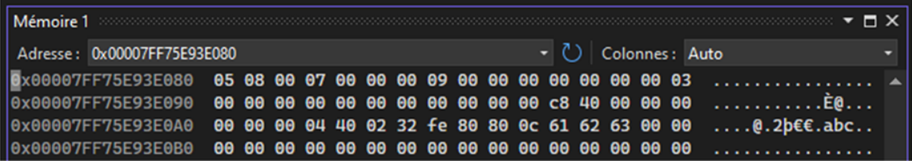

# TP4
## 1. Registres des processeurs x64
- **Quelle est le lien entre le registre `RAX` et le registre `EAX` ?**
	<br>Le registre `EAX` représente les <u>32 bits de poids faible</u> de `RAX`.
- **Quelle est le lien entre le registre `EAX` et le registre `AX` ?** 
	<br>Le registre `AX` représente les <u>16 bits de poids faible</u> de `EAX`.
- **Quelle est le lien entre le registre `AX` et les registres `AH` et `AL` ?**
	<br>`AH` répresente les <u>8 bits de poids fort</u> de `AX`, et `AL` représente les <u>8 bits de poids faible</u> de `AX`.
- **Sachant qu’une case mémoire peut contenir 8 bits, quelle est en octets, la taille de l'espace mémoire qu'on peut adresser avec une adresse codée sur 16 bits ?**	
	<br><u>2¹⁶ octets</u>, soit 64 Kibioctets
- **Même question pour une adresse codée sur 20 bits ?** 
	<br><u>2²⁰ octets</u>, soit 1 Mébioctets.
- **Même question pour une adresse codée sur 32 bits ?** 
	<br><u>2³² octets</u>, soit 4 Gibioctets.
- **Même question pour une adresse codée sur 64 bits ?** 
	<br><u>2⁶⁴ octets</u>, soit 16 Exbioctets, ou approximativement 18 milliards de milliards d'octets.
- **Si le registre 64 bits `RAX` contient (ABCDEF0123456789)<small>16</small>, quel est le contenu en hexa des registres suivants :**

	| Registre | Contenu en Hexadécimal |
	|----------|------------------------|
	| AH       | 67                     |
	| AL       | 89                     |
	| AX       | 6789                   |
	| EAX      | 23456789               |

- **Le registre `RSP` (Stack Pointer) sert à pointer vers la prochaine case libre de la pile. Quelle est le rôle de la pile ?**
	- stocker les variables locales des fonctions. Lorsqu'une fonction se termine, c'est dépilé.
	- stocker les adresses de retour des fonctions.
	- zone de transfert pour les paramètres de fonctions.
- **Que contient le registre des indicateurs `EFL` ? Quand est-il modifié ?**
	<br>Le registre `EFL` contient des informations sur certaines propriétés du dernier résultat de l'`UAL`, tel que
	- si le nombre est négatif.
	- si il y a une retenue.
	- sa parité (s'il est pair ou non).
	Après chaque instruction arithmétique ou logique, ou l'instruction `CMP`.
## 2. Premier programme
Le programme C++ ci-dessous écrit dans le fichier `main.cpp` fait appel à une fonction en ASM x64 écrite dans le fichier `prog.asm`.
 
`main.cpp`:
```cpp
#include <iostream>
using namespace std;
extern "C" int somme(int a, int b);
int main()
{
	int a, b;
	cout << "Entrez un premier entier : "; cin >> a;
	cout << "Entrez un deuxieme entier : "; cin >> b;
	cout << a << " + " << b << " = " << somme(a,b) << endl;
	return 0;
}
```

`prog.asm`:
```x86asm
.CODE
	somme PROC
		MOV EAX,ECX
		ADD EAX,EDX
		RET
	somme ENDP
END
```

- **Expliquez le rôle de la ligne** ```extern "C" int somme(int a, int b);```

	<br>Le terme `extern` sert à dire au compilateur C++ que cette fonction ne doit pas être compilé par lui, et ne plantera pas au moment où il ne trouvera pas sa définition.

	<br>Le `"C"` sert à dire au compilateur quel protocole d'appel utiliser, ici, celui du langage de programmation C.

- **Que définissent les lignes `.CODE` et `END` ?**
	<br>Le `.CODE` est une directive pour s'adresser au compilateur, et lui dire qu'ici commence la section où commence les intruction du programme.

	<br>Le `END` signifie la fin du programme.
- **Que définissent les lignes `somme PROC` et `somme ENDP` ?**
	<br>Elles définissent **le début et la fin** de la fonction `somme`. `PROC` comme *procédure*, et `ENDP` comme *end procédure*.

- **Quelle est la taille en bits des paramètres `a` et `b` et quels registres sont utilisés pour transmettre leurs valeurs à la fonction `somme` ?**
	<br>32 bits, car le type `int` est compilé en tant que 32 bits par défaut sur la majorité des compilateurs. 
	<br>Les registres utilisés pour transmettre les valeurs, fixés par la convention FastCall, sont `EAX` pour `a`, et `EDX` pour `b`.

- **Quelle est la taille en bits de la valeur retournée par la fonction somme et quel registre est utilisé pour cela ?**
	<br>La taille en bits de la valeur retournée est de 32 bits puisqu'il s'agit d'un `int`
- **Que fait l’instruction `MOV EAX,ECX` ?**
	<br>Ça copie `ECX` dans `EAX`.
- **Que fait l’instruction `ADD EAX,EDX` ?**
	<br>Elle ajoute la valeur de `b` (dans `EDX`) à celle de `a` (directement dans le registre de retour, ici `EAX`), et l'écrit dans ce même registre de retour.

## 3. Programme avec section de données
```x86asm
.DATA
	var1	BYTE	5
	var2	WORD	8
	var3	DWORD	7
	var4	QWORD	9
	var5	TBYTE	3
	var6	REAL4	6.25
	var7	REAL8	2.5
	var8	DB		2
	var9	DB		'2'
	var10	DB		-2, 128, -128, 12
	var11	DB		'abc',0
	var12	DB		?
.CODE
	fct PROC
		MOV AL,var1
		MOV BL,var8
		ADD AL,BL
		MOV var12,AL
		RET
	fct ENDP
END
```
Types: 
| Type | Signification | Taille (octets) | Taille (bits) |
|------|---------------|-----------------|---------------|
|`BYTE`| Octet | 1 | 8 |
|`WORD`| Mot | 2 | 16 |
|`DWORD`| Double mot | 4 | 32 |
|`QWORD`| Quadruple mot| 64 |
|`TBYTE`| Entier 80bits | 10 | 80 |
|`REAL4`| Réel | 4 | 64 |
|`REAL8`| Réel | 8 | 128 |
|`DB`| Définir Byte (octet) | - | - |
|`DW`| Définir mot | - | - |
|`DQ`| Définir Quadruple mot  | - | - |
|`DD`| Définir Double mot | - | - |
|`DR`| Définir Réel | - | - |

- **Quel est le rôle de la ligne .DATA ?**
	<br>À déclarer les variables du programme.
- **La section DATA commence à l’adresse mémoire `0x00007FF75E93E080`. Le contenu de la mémoire à partir de cette adresse est indiqué ci-dessous.**


En vous aidant de cette copie d’écran, remplissez le tableau ci-dessous. 
| Variable | Adresse de début     | Nombre d’octets | Contenu des octets en hexa | Explication |
|----------|----------------------|-----------------|----------------------------|-------------|
| `var1`   |0x00007FF75E93E0**80**| 1               | 05                         | Codage de l'entier 5 sur 8 bits. |
| `var2`   |0x00007FF75E93E0**81**| 2               | 08 00                      | Codage de l'entier 8 sur 16 bits. |
| `var3`   |0x00007FF75E93E0**83**| 4               | 07 00 00 00                | Codage de l'entier 7 sur 32 bits. |
| `var4`   |0x00007FF75E93E0**87**| 8               | 09 00 00 00 00 00 00 00    | Codage de l'entier 9 sur 64 bits. |
| `var5`   |0x00007FF75E93E0**8F**| 10              | 03 (00 x 9)                | Codage de l'entier 3 sur 80 bits. |
| `var6`   |0x00007FF75E93E0**99**| 4               | 00 00 C8 40                | Codage du réel 6.25 en simple précision sur 32 bits. |
| `var7`   |0x00007FF75E93E0**9D**| 8               | 00 00 00 00 00 00 04 40    | Codage du réel 2.5 en double précision 64 bits. |
| `var8`   |0x00007FF75E93E0**A5**| 1               | 02                         | Codage de l'entier 2 sur 8 bits. |
| `var9`   |0x00007FF75E93E0**A6**| 1               | 32                         | Codage du caractère '2' en ASCII. |
| `var10`  |0x00007FF75E93E0**A7**| 4               | FE 80 80 0C                | Codage d'un tableau d'entiers -2; 128; -128; 12 sur 8 bits |
| `var11`  |0x00007FF75E93E0**AB**| 4               | 61 62 63 00                | Codage de la chaine "abc" avec le caractère de fin de chaîne '\0' |
| `var12`  |0x00007FF75E93E0**AF**| 1               | 00                         | ? signifie variable non initialisée |
Attention: Le contenu des octets en hexa est inversé (poids faible avant poids fort sur Intel).

- Que remarquez-vous en général pour toutes les variables ?
	<br>C'est codé en Little Endian (poids faible avant poids fort, sauf chaines).
- Que remarquez-vous en particulier pour la variable var10 ?
	<br>On remarque que le compilateur a décidé de coder 128 en binaire naturel sur 8 bits et -128 en complément à 2 sur 8 bits.
	Ce qui donne finalement le même code 0x80. La question est alors : comment le processeur sait s'il doit interpréter une valeur en binaire naturel ou en complément à 2?
	Il est important de comprendre qu'en assembleur, la gestion du typage des données est à la charge du programmeur. C'est à lui de choisir les bonnes instructions pour que le processeuur interprète les valeurs dans le bon codage. Flemme d'écrire la suite dsl.
- Quel autre type peut-on utiliser à la place respectivement de BYTE, WORD, DWORD, QWORD, TWORD ?
	<br>On peut utiliser DB, DW, DD, DQ, et DT.
- Le tableau ci-dessous indique le code machine généré pour les instructions du programme